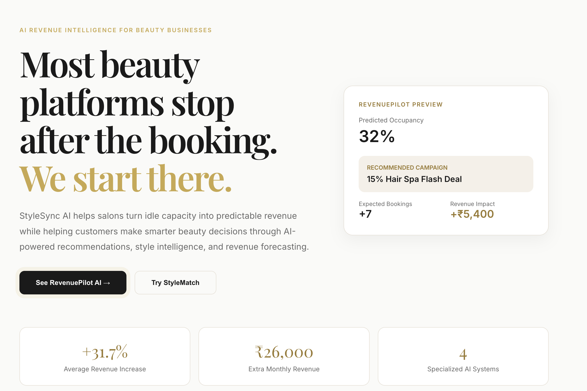

# StyleSync AI

<p align="center">
  
</p>


> AI-Powered Revenue Intelligence Platform for Beauty Businesses

Most beauty platforms stop after the booking. StyleSync AI starts there.

We help salons turn idle capacity into predictable revenue while helping customers make confident, personalised beauty decisions — powered by four specialised AI agents working together.

---

## Live Demo

| | URL |
|---|---|
| Frontend | https://style-sync-ai-chi.vercel.app |
| Backend | https://stylesync-ai-z9g8.onrender.com |

---

## The Problem

Empty salon chairs generate zero revenue. Existing platforms optimise bookings. Nobody optimises salon economics.

StyleSync AI changes that.

---

## Features

### RevenuePilot AI — Hero Feature
Predicts occupancy gaps before they become permanent revenue loss. Generates targeted flash campaigns with projected bookings and ₹ revenue impact.

### AI StyleMatch
Analyses face shape from a selfie and matches it against inspiration images to generate a compatibility score, recommended style, and personalised beauty insights.

### Look Transfer Protocol
Converts any inspiration image into a precise six-point stylist blueprint — length, cut, layers, colour, texture, and styling notes.

### Beauty Intelligence
Scores hair health across four metrics (moisture, frizz, split ends, scalp condition) and generates a personalised treatment plan.

---

## Architecture

```
User Browser
      │
      ▼
React + Vite Frontend (Vercel)
      │
      │  REST API calls via /api/*
      ▼
FastAPI Backend (Render)
      │
      ▼
Groq — LLaMA 3.3 70B
      │
      ▼
Structured JSON Response
      │
      ▼
Interactive Dashboard + AI Results
```

---

## Tech Stack

| Layer | Technology |
|---|---|
| Frontend | React + Vite |
| Styling | Inline CSS with CSS Variables |
| Backend | FastAPI (Python) |
| AI | Groq — LLaMA 3.3 70B |
| Frontend Deploy | Vercel |
| Backend Deploy | Render |

---

## Local Setup

### 1. Clone the repository

```bash
git clone https://github.com/techAsmita/StyleSync-AI.git
cd StyleSync-AI
```

### 2. Backend

```bash
cd backend
python3 -m venv venv
source venv/bin/activate
pip install -r requirements.txt
```

Create a `.env` file inside `backend/`:

```
GROQ_API_KEY=your_groq_api_key_here
```

Start the backend:

```bash
uvicorn main:app --reload
```

Backend runs at `http://localhost:8000`

### 3. Frontend

```bash
cd frontend
npm install
npm run dev
```

Frontend runs at `http://localhost:5173`

---

## Environment Variables

| Variable | Where | Description |
|---|---|---|
| `GROQ_API_KEY` | `backend/.env` | Groq API key for LLaMA inference |

> The `.env` file is gitignored and never committed to the repository.

---

## Repository Structure

```
StyleSync-AI/
│
├── backend/
│   ├── main.py              # FastAPI — all 4 AI endpoints
│   ├── requirements.txt     # Python dependencies
│   └── render.yaml          # Render deployment config
│
├── frontend/
│   ├── public/
│   ├── src/
│   │   ├── components/      # All page components
│   │   └── utils/           # formatText, hashImage helpers
│   └── package.json
│
└── README.md
```

---

## Deployment

Frontend is deployed on **Vercel**.

Backend API is deployed on **Render**.

The frontend communicates with the FastAPI backend through REST endpoints secured with environment variables. In development, Vite proxies all `/api/*` requests to the local backend automatically.

---

## Future Roadmap

- Multi-salon analytics dashboard
- WhatsApp campaign automation
- Appointment forecasting using historical bookings
- Customer retention insights
- Regional language support for Tier 2 and Tier 3 markets

---

## Vision

StyleSync AI demonstrates how AI can move beyond appointment booking to become a true revenue intelligence platform for beauty businesses — helping salons grow sustainably while delivering personalised customer experiences.

---

Built with ❤️ for **AI Startup Buildathon 2026**